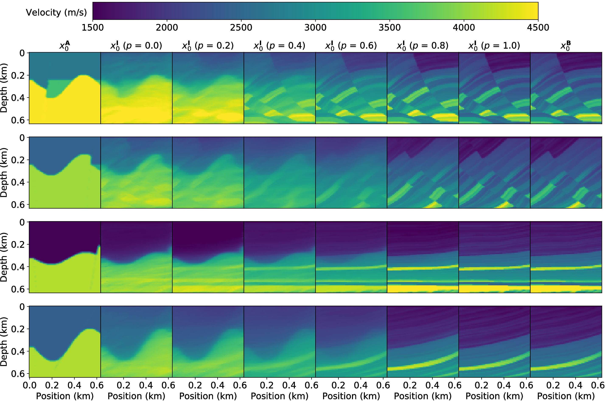
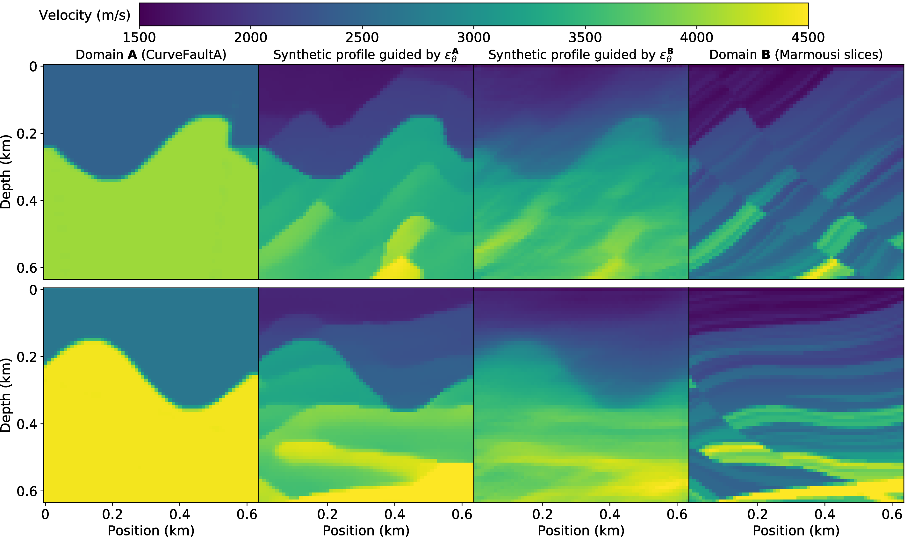

# DFVG: Diffusion-Based Fusion for Velocity Model Generation

---

We propose a velocity model generation approach that fuses existing data from multiple domains using diffusion autoencoders, termed DFVG.
The key idea is to map velocity models from different domains into latent spaces using diffusion autoencoders.
By fusing their latent representations, diffusion models are then used to generate velocity models containing combined structural and semantic information.

Some internal filenames retain the legacy name **SMDA** for compatibility.

 

## Folder Description

- /checkpoint: saving the intermediate results of network training  
- /configuration: stored in configuration information  
- /data: velocity profile dataset  
- /network: network architecture (U-Net noise prediction network + autoencoder)  
- /sampled_imgs: stores the velocity profiles synthesized by smda.py and smda_for_single.py

## File Description

- **diffusion.py**: It implements the reverse and forward generation process of DDIM, as well as the training of noise prediction network $\epsilon_\theta$.

- **eval_autoenc.py**: It will evaluate the training effect of the autoencoder.

- **eval_eps.py**: It will evaluate the training effect of the noise prediction network $\epsilon_\theta$.
(*Here, our evaluation approach is different from that proposed in the paper. We only use one DDIM encoding and decoding.
Specifically, it only implements encoding to one category of OpenFWI and decoding to another category of OpenFWI.
Its purpose is to evaluate whether DDIM is well trained and has reliable reconstruction capability.*)

- **smda_for_single.py**: It implements DFVG on a single data pair (batch size = 1) without the batch synthesis module.

- **smda.py**: It implements DFVG on multiple data pairs using the batch synthesis module.

- **train_autoenc.py**: It is used to train the autoencoder.

- **train_eps.py**: It is used to train the noise prediction network $\epsilon_\theta$.

- **fwi_dataset.py**: It controls data reading and other operations related to DL-FWI.

## Precautions

The data here are all velocity profiles (often called velocity models in the field of earth science), and no seismic observation records are provided.

If you need them, they will need to be generated locally via the forward simulation code.

In addition, we have made the M-DFVG dataset mentioned in our paper public.
This dataset is generated by fusing CurveFaultA with Marmousi.
You can find it in the `data` folder, which contains a total of 24,000 velocity profiles.

 